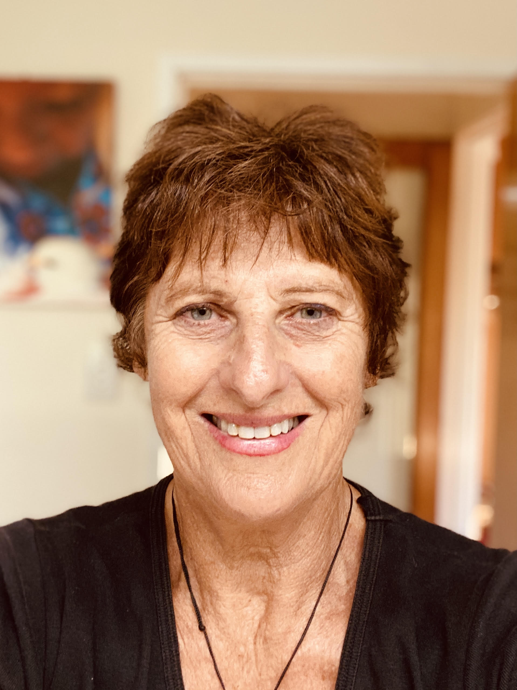

## Helen Bowen

#### Barrister

- Criminal and Youth defence lawyer
- Drug court lawyer in Te Kooti Te Whare Whakapiki Wairua since the New Zealand pilot began in 2012
- Specialist in the therapeutic courts acting for drug and alcohol impaired offenders as well as many years experience as a lawyer in youth justice – including Te Kooti Rangatahi and Pasifika Courts

#### Restorative Justice consultant

#

International and Domestic Memberships:

- Global Advisory Committee Restorative Justice International
- European Forum of Restorative Justice
- Restorative Justice Aotearoa
- Co-Facilitates private Restorative Justice with Winsome Thornley
- Supervisor - Ministry of Justice (MoJ) contracted Restorative Justice Facilitators
- Chairperson - Hei Tatau Pounamu Trust - post-sentence Restorative Justice
- Trustee - Auckland Restorative Justice Trust

Helen is a barrister who has worked in civil, criminal and youth jurisdictions. Her speciality is the therapeutic Courts and has a particular interest and skill in advocacy and training concerning Restoriative Justice. Helen's skill set extends to working with drug and alcohol impaired offenders in the AODTC Courts. She has been on the defence team since 2012 and was appointed to a small team of experienced lawyers for the purposes of conducting the AODTC pilot programme.

  

